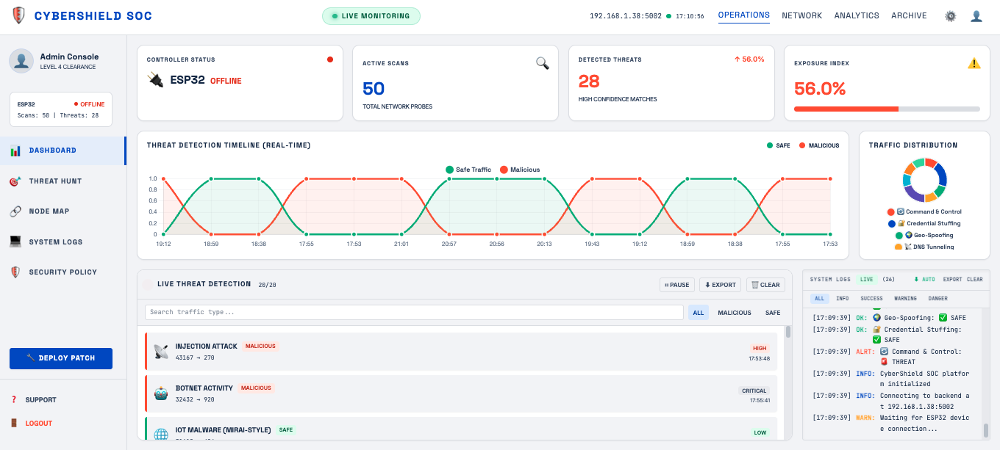
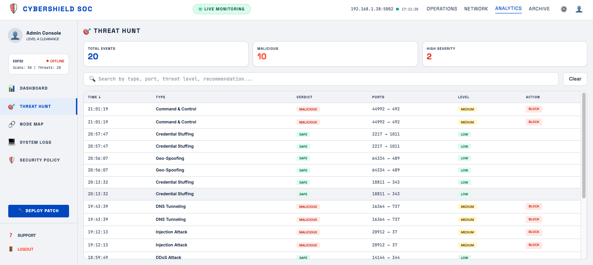

# 🛡️ CyberShield - ESP32 IoT Malware Detection System

A professional-grade IoT security monitoring platform featuring real-time malware detection, machine learning analysis, and an enterprise-class web dashboard for detecting and analyzing IoT threats.

---

## 📋 Table of Contents

1. [Quick Start](#quick-start)
2. [System Overview](#system-overview)
3. [Features](#features)
4. [UI Showcase](#ui-showcase)
5. [Architecture](#architecture)
6. [Installation & Setup](#installation--setup)
7. [Usage Guide](#usage-guide)
8. [Configuration](#configuration)
9. [Troubleshooting](#troubleshooting)
10. [Project Structure](#project-structure)

---

## 🚀 Quick Start

### Prerequisites
- Python 3.8+
- Node.js 16+
- ESP32 microcontroller
- Arduino IDE (for ESP32 firmware upload)

### Step 1: Install Dependencies
```bash
# Install Python dependencies
pip install -r requirements.txt

# Install Node.js dependencies
npm install
```

### Step 2: Build React Dashboard
```bash
npm run build
```

### Step 3: Start All Services
```bash
# Terminal 1: ML API Server (Port 8080)
python3 cloud_api_server.py

# Terminal 2: Dashboard Backend (Port 5002)
python3 dashboard_server.py

# Terminal 3: Mobile Traffic Sender (Port 8090)
python3 serve_mobile.py
```

### Step 4: Check Your Network IP
```bash
# Run this command to find your machine's IP address
ifconfig | grep "inet " | grep -v "127.0.0.1"
```

### Step 5: Access the Platform
Replace `<YOUR_IP>` with the IP from the command above:
- **Dashboard**: http://`<YOUR_IP>`:5002
- **Mobile Traffic Sender**: http://`<YOUR_IP>`:8090/mobile_traffic_sender.html
- **ML API Health**: http://`<YOUR_IP>`:8080/health

---

## 🎯 System Overview

CyberShield is a complete IoT security solution consisting of:

### Core Components

1. **ML Detection Engine** (Port 8080)
   - Multi-model threat detection system
   - 3 trained models: Binary RF, Isolation Forest, Multiclass RF
   - Real-time traffic analysis
   - >90% accuracy on IoT-23 dataset

2. **Dashboard Backend** (Port 5002)
   - Flask + SocketIO real-time server
   - WebSocket support for live updates
   - SQLite database for historical logging
   - REST API endpoints

3. **Mobile Traffic Sender** (Port 8090)
   - Web-based traffic simulation interface
   - 12 different attack types
   - Real-time threat analysis
   - Mobile-friendly UI

4. **ESP32 Firmware**
   - Network traffic capture and analysis
   - LED indicators for threat status
   - WiFi connectivity
   - Serial debugging output

---

## ✨ Features

### Real-Time Detection
- ✅ Instant malware identification
- ✅ Multi-model consensus analysis
- ✅ Sub-second response times
- ✅ WebSocket live updates

### Machine Learning
- ✅ Binary Classification (Benign/Malware)
- ✅ Isolation Forest Anomaly Detection
- ✅ Multiclass Traffic Type Classification
- ✅ Feature scaling and normalization

### Dashboard Analytics
- ✅ Live threat feed with timestamps
- ✅ Threat timeline charts
- ✅ Traffic type distribution
- ✅ System status monitoring
- ✅ Historical data analysis

### Security Features
- ✅ Rule-based attack detection
- ✅ Port signature matching
- ✅ Traffic volume analysis
- ✅ Threat level classification
- ✅ Confidence scoring

### Supported Attack Types
1. 🌐 IoT Malware (Mirai-style)
2. 📤 Data Exfiltration Attempt
3. 🔓 Brute Force Attack
4. 🎯 DDoS Attack
5. 🔐 Credential Stuffing
6. 📡 DNS Tunneling
7. 🕵️ Reconnaissance Scan
8. 💉 Injection Attack
9. 🔄 Command & Control
10. 📊 Botnet Activity


---

## 🎨 UI Showcase

### Dashboard Overview


The main dashboard provides:
- Real-time threat detection feed
- System status indicators
- Threat statistics and metrics
- Live chart visualizations
- Professional UI with glass morphism effects

### Threat Analysis View


The threat analysis view shows:
- Detailed threat information
- Traffic type classification
- Threat level indicators
- Recommended actions
- Historical threat patterns

---

## 🏗️ Architecture

### System Architecture Diagram

```
┌─────────────────────────────────────────────────────────────┐
│                    CyberShield Platform                      │
├─────────────────────────────────────────────────────────────┤
│                                                               │
│  ┌──────────────────┐  ┌──────────────────┐  ┌────────────┐ │
│  │   ESP32 Device   │  │  Mobile Browser  │  │  Dashboard │ │
│  │  (Detector)      │  │  (Traffic Sender)│  │  (React)   │ │
│  └────────┬─────────┘  └────────┬─────────┘  └─────┬──────┘ │
│           │                     │                   │        │
│           └─────────────────────┼───────────────────┘        │
│                                 │                             │
│                    ┌────────────▼────────────┐               │
│                    │  Dashboard Backend      │               │
│                    │  (Flask + SocketIO)     │               │
│                    │  Port: 5002             │               │
│                    └────────────┬────────────┘               │
│                                 │                             │
│                    ┌────────────▼────────────┐               │
│                    │  ML Detection Engine    │               │
│                    │  (Flask API)            │               │
│                    │  Port: 8080             │               │
│                    │  - Binary RF            │               │
│                    │  - Isolation Forest     │               │
│                    │  - Multiclass RF        │               │
│                    └────────────┬────────────┘               │
│                                 │                             │
│                    ┌────────────▼────────────┐               │
│                    │  SQLite Database        │               │
│                    └─────────────────────────┘               │
│                                                               │
└─────────────────────────────────────────────────────────────┘
```

### Data Flow

1. **Traffic Generation** → Mobile/ESP32 sends network traffic
2. **Feature Extraction** → System extracts network features
3. **ML Analysis** → 3 models analyze traffic patterns
4. **Rule-Based Override** → Port signatures and volume checks
5. **Threat Classification** → Benign/Malware determination
6. **Dashboard Update** → Real-time WebSocket broadcast
7. **Database Logging** → Historical record storage

---

## 📦 Installation & Setup

### 1. Clone Repository
```bash
git clone <repository-url>
cd esp32_malware_client
```

### 2. Install Python Dependencies
```bash
pip install -r requirements.txt
```

Required packages:
- flask==2.3.3
- flask-cors==4.0.0
- flask-socketio==5.3.6
- scikit-learn==1.3.0
- pandas==2.0.3
- numpy==1.24.3
- joblib==1.3.2
- imbalanced-learn==0.11.0

### 3. Install Node.js Dependencies
```bash
npm install
```

### 4. Configure Network IP

First, check your current network IP:
```bash
ifconfig | grep "inet " | grep -v "127.0.0.1"
```

Then update the `.env` file with your IP:
```env
VITE_SERVER_IP=<YOUR_IP>
```

Update in Python files:
- `dashboard_server.py`: `MAC_IP = os.environ.get('MAC_IP', '<YOUR_IP>')`
- `cloud_api_server.py`: Default IP configuration
- `esp32_malware_client.ino`: WiFi IP settings

### 5. Build React Dashboard
```bash
npm run build
```

### 6. Populate Sample Data (Optional)
```bash
python3 populate_db.py
```

---

## 🎮 Usage Guide

### Starting the System

#### Option 1: Manual Start (Recommended for Development)
```bash
# Terminal 1: ML API Server
python3 cloud_api_server.py

# Terminal 2: Dashboard Backend
python3 dashboard_server.py

# Terminal 3: Mobile Traffic Sender
python3 serve_mobile.py
```

#### Option 2: Background Process Start
```bash
# Start all services in background
nohup python3 cloud_api_server.py > api.log 2>&1 &
nohup python3 dashboard_server.py > dashboard.log 2>&1 &
nohup python3 serve_mobile.py > mobile.log 2>&1 &
```

### Accessing the Dashboard

1. **Find Your Network IP**
   ```bash
   ifconfig | grep "inet " | grep -v "127.0.0.1"
   ```

2. **Open Dashboard**
   - URL: http://`<YOUR_IP>`:5002
   - Shows real-time threat detection
   - Displays system statistics
   - Historical threat analysis

3. **Send Test Traffic**
   - URL: http://`<YOUR_IP>`:8090/mobile_traffic_sender.html
   - Select attack type
   - Click "Analyze Traffic"
   - View results on dashboard

4. **Monitor ESP32**
   - Upload `esp32_malware_client.ino` to ESP32
   - Open Serial Monitor (115200 baud)
   - Watch real-time detection output
   - LED indicators show threat status

### Dashboard Features

#### Live Feed
- Real-time threat detection results
- Source IP and traffic type
- Threat level indicators
- Timestamp and recommendations

#### Threat Hunt
- Search and filter threats
- Sort by threat level
- View detailed threat information
- Export threat data

#### System Logs
- System events and status
- Connection information
- Error messages
- Performance metrics

#### Charts & Analytics
- Threat timeline visualization
- Traffic type distribution
- Threat rate trends
- System health indicators

---

## ⚙️ Configuration

### Network Configuration

Update IP address when network changes:

```bash
# Check current IP
ifconfig | grep "inet " | grep -v "127.0.0.1"

# Update .env file with your IP
VITE_SERVER_IP=<YOUR_IP>

# Rebuild React app
npm run build

# Restart servers
```

### ML Model Configuration

Models are pre-trained on IoT-23 dataset:
- **Binary RF**: 99.99% accuracy
- **Isolation Forest**: 90.54% accuracy
- **Multiclass RF**: 99.98% accuracy

To retrain models:
```bash
python3 train_models.py
```

### Database Configuration

SQLite database stores:
- Timestamp
- Source IP
- Ports (source → destination)
- Malicious flag
- Confidence score
- Threat level
- Traffic type

### ESP32 Configuration

Edit `esp32_malware_client.ino`:
```cpp
const char* ssid     = "Your_WiFi_SSID";
const char* password = "Your_WiFi_Password";
const char* serverIP = "<YOUR_IP>";  // Use the IP from: ifconfig | grep "inet " | grep -v "127.0.0.1"
const int serverPort = 8080;
```

---

## 🔧 Troubleshooting

### Dashboard Not Loading

**Problem**: Infinite loading on http://`<YOUR_IP>`:5002

**Solutions**:
1. Check IP address is correct
   ```bash
   ifconfig | grep "inet " | grep -v "127.0.0.1"
   ```

2. Verify dashboard server is running
   ```bash
   lsof -i :5002
   ```

3. Check React build exists
   ```bash
   ls -la dist/index.html
   ```

4. Rebuild React app
   ```bash
   npm run build
   ```

### ML API Not Responding

**Problem**: API server returns 500 errors

**Solutions**:
1. Verify models are loaded
   ```bash
   curl http://localhost:8080/health
   ```

2. Check model files exist
   ```bash
   ls -la *.pkl
   ```

3. Verify Python dependencies
   ```bash
   pip install -r requirements.txt
   ```

### ESP32 Connection Issues

**Problem**: ESP32 not connecting to WiFi

**Solutions**:
1. Verify WiFi credentials in firmware
2. Check ESP32 is on same network
3. Monitor serial output for errors
4. Verify IP address in firmware matches server

### WebSocket Connection Errors

**Problem**: Dashboard shows "Reconnecting..."

**Solutions**:
1. Check firewall allows port 5002
2. Verify SocketIO is running
3. Check browser console for errors
4. Restart dashboard server

### No Data in Dashboard

**Problem**: Dashboard shows empty threat list

**Solutions**:
1. Populate sample data
   ```bash
   python3 populate_db.py
   ```

2. Send test traffic from mobile sender
3. Check ESP32 is connected
4. Verify database has records
   ```bash
   sqlite3 dashboard.db "SELECT COUNT(*) FROM dashboard_logs;"
   ```

---

## 📁 Project Structure

```
esp32_malware_client/
├── 📄 README.md                          # This file
├── 📄 .env                               # Environment configuration
├── 📄 .gitignore                         # Git ignore rules
│
├── 🐍 Python Backend
│   ├── cloud_api_server.py              # ML detection API (Port 8080)
│   ├── dashboard_server.py              # Dashboard backend (Port 5002)
│   ├── serve_mobile.py                  # Mobile server (Port 8090)
│   ├── train_models.py                  # Model training script
│   ├── populate_db.py                   # Sample data generator
│   └── requirements.txt                 # Python dependencies
│
├── 🎨 Frontend (React)
│   ├── src/
│   │   ├── App.jsx                      # Main React component
│   │   ├── main.jsx                     # React entry point
│   │   ├── index.css                    # Global styles
│   │   └── components/
│   │       ├── Navbar.jsx               # Top navigation
│   │       ├── Sidebar.jsx              # Left sidebar
│   │       ├── MetricsGrid.jsx          # Statistics cards
│   │       ├── LiveFeed.jsx             # Real-time threats
│   │       ├── ThreatHunt.jsx           # Threat search
│   │       ├── SystemLogs.jsx           # System events
│   │       ├── ChartsSection.jsx        # Analytics charts
│   │       ├── NodeMap.jsx              # Network visualization
│   │       ├── SecurityPolicy.jsx       # Security settings
│   │       ├── SettingsModal.jsx        # Settings dialog
│   │       └── ProfileModal.jsx         # User profile
│   ├── dist/                            # Built React app
│   ├── package.json                     # Node dependencies
│   ├── vite.config.js                   # Vite configuration
│   └── tailwind.config.js               # Tailwind CSS config
│
├── 🔧 ESP32 Firmware
│   ├── esp32_malware_client.ino         # Main detector firmware
│   └── esp32_cam_sender.ino             # CAM sender firmware
│
├── 📊 ML Models
│   ├── advanced_iot23_binary_rf.pkl     # Binary classifier
│   ├── advanced_iot23_isolation_forest.pkl  # Anomaly detector
│   ├── advanced_iot23_multiclass_smote.pkl  # Traffic classifier
│   └── advanced_iot23_scaler.pkl        # Feature scaler
│
├── 🌐 Web Interfaces
│   ├── index.html                       # Dashboard HTML
│   ├── mobile_traffic_sender.html       # Mobile traffic UI
│   └── assets/
│       ├── dashboard.png                # Dashboard screenshot
│       └── threat.png                   # Threat view screenshot
│
├── 💾 Database
│   └── dashboard.db                     # SQLite database
│
└── 📚 Documentation
    └── ESP32_IoT_Malware_Detection_Report.tex  # Technical report
```

---

## 🔐 Security Considerations

### Best Practices

1. **Network Security**
   - Use VPN for remote access
   - Firewall ports 8080 and 5002
   - Change default WiFi credentials
   - Use dynamic IP configuration (.env file)

2. **Data Protection**
   - Encrypt sensitive data
   - Secure database backups
   - Use HTTPS in production

3. **Model Security**
   - Validate input data
   - Monitor model performance
   - Update models regularly

4. **ESP32 Security**
   - Use secure WiFi (WPA2/WPA3)
   - Implement rate limiting
   - Monitor for unauthorized access

---

## 📈 Performance Metrics

### System Performance

| Metric | Value |
|--------|-------|
| API Response Time | <100ms |
| Dashboard Update Latency | <500ms |
| Model Inference Time | <50ms |
| Database Query Time | <10ms |
| WebSocket Broadcast | Real-time |

### Model Accuracy

| Model | Accuracy | Dataset |
|-------|----------|---------|
| Binary RF | 99.99% | IoT-23 |
| Isolation Forest | 90.54% | IoT-23 |
| Multiclass RF | 99.98% | IoT-23 |

---

## 🤝 Contributing

Contributions are welcome! Please:

1. Fork the repository
2. Create a feature branch
3. Make your changes
4. Submit a pull request

---

## 📝 License

This project is licensed under the MIT License - see LICENSE file for details.

---

## 📞 Support

For issues and questions:

1. Check the [Troubleshooting](#troubleshooting) section
2. Review system logs
3. Check ESP32 serial output
4. Verify network configuration

---

## 🎓 Technical Details

### ML Model Architecture

**Binary Random Forest**
- 100 trees
- Max depth: 20
- Min samples split: 2
- Optimized for speed and accuracy

**Isolation Forest**
- 100 estimators
- Contamination: 0.1
- Detects anomalies in traffic patterns

**Multiclass Random Forest**
- 100 trees
- 12 traffic type classes
- SMOTE oversampling for balance

### Feature Engineering

Extracted features from network traffic:
- Packet counts (orig_pkts, resp_pkts)
- Byte counts (orig_bytes, resp_bytes)
- Duration and timing
- Protocol information
- Port numbers and ranges

### Detection Pipeline

1. **Feature Extraction** → Extract network features
2. **Scaling** → Normalize features
3. **Model Inference** → Run 3 models
4. **Rule-Based Override** → Apply port/volume rules
5. **Confidence Calculation** → Aggregate predictions
6. **Threat Classification** → Determine threat level

---

## 🚀 Future Enhancements

- [ ] Deep learning models (LSTM, CNN)
- [ ] Real-time packet capture
- [ ] Advanced threat hunting
- [ ] Automated response actions
- [ ] Multi-device management
- [ ] Cloud integration
- [ ] Mobile app
- [ ] Advanced reporting

---

**Last Updated**: May 18, 2026

**Version**: 1.0.0

**Status**: Production Ready ✅
